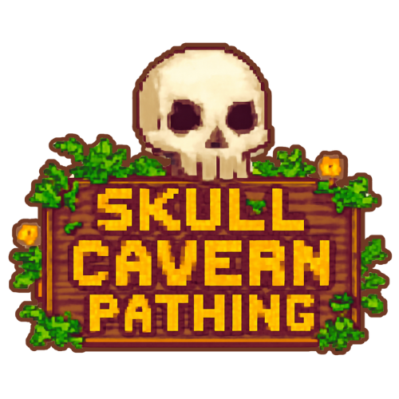

# Skull Cavern Pathing

<p align="center">
  
</p>

A web-based interactive visualization tool that demonstrates and compares pathfinding algorithms in real-time. Watch Dijkstra's algorithm and A* algorithm simultaneously find the shortest path between two points while learning about graph traversal in a visually engaging way!

## Live Demo

Visit the application at: [skullcavern.vercel.app](https://skullcavern.vercel.app)

> **⚠️ Important Note:** For the best and most bug-free experience, we recommend cloning the repository and running the application locally rather than using the deployed website. The deployed version may occasionally experience issues due to Vercel's serverless limitations.

## What It Does

This application lets you:
- Create custom maps with walls and weighted obstacles
- Place start and end points
- Watch both algorithms search for the best path in real-time
- Directly compare Dijkstra's and A* algorithms
- Generate various types of random mazes to test the algorithms
- Save and load custom grid configurations
- Use step-by-step mode to understand each algorithm decision

## Demo

Open the application in your browser and start exploring pathfinding algorithms with an intuitive, Minecraft-inspired interface.

## Installation

### Basic Usage (No Installation)
1. Clone the repository:
   ```
   git clone https://github.com/Jehuuuu/cmsc126la3.git
   cd cmsc126la3
   ```
2. Open `index.html` in any modern web browser

### Development Setup (with npm)
1. Clone the repository:
   ```
   git clone https://github.com/Jehuuuu/cmsc126la3.git
   cd cmsc126la3
   ```
2. Install dependencies:
   ```
   npm install
   ```
3. Start the development server:
   ```
   npm run dev
   ```
4. Open your browser at `http://localhost:3000`

## How to Use

### Basic Controls
1. **Set up your grid**:
   - Use "Set Start" to place your starting point (green)
   - Use "Set End" to place your destination point (red)
   - Draw walls with "Add Walls" to create obstacles
   - Add weighted nodes that are more difficult to traverse
   - Use "Erase" to remove anything you've placed

2. **Start the visualization**:
   - Click "Find Path" to watch both algorithms work simultaneously
   - Watch as the algorithms explore (blue cells) and find the optimal path (yellow)
   - Compare which algorithm finds the path more efficiently

3. **Adjust settings**:
   - Change grid size (10x10, 15x15, 20x20, 25x25, or custom)
   - Control visualization speed (Slow, Medium, Fast)
   - Choose between Auto mode or Step-by-Step mode
   - Use the swap button to switch algorithm positions

### Advanced Features
- **Generate mazes** with different algorithms (Random, Recursive Division)
- **Place random start/end points** to quickly test new scenarios
- **Add weighted nodes** to test how algorithms handle variable costs
- **Save and load** grid configurations
- Use **keyboard shortcuts** for faster interaction:
  - `S`: Set Start tool
  - `E`: Set End tool
  - `W`: Add Walls tool
  - `D`: Erase tool
  - `C`: Clear grid
  - `R`: Generate random maze
  - `Space`: Start visualization
  - Arrow keys: Navigate steps (in Step-by-Step mode)
  - `H`: Show help
  - `Escape`: Close modal

## How It Works

The application implements and compares two popular pathfinding algorithms:

### Dijkstra's Algorithm
- Guarantees the shortest path
- Explores in all directions equally
- Considers the cost to reach each node
- More thorough but less efficient in direct pathfinding

### A* Algorithm
- Uses heuristics to find paths more efficiently
- Prioritizes nodes that seem closer to the destination
- Combines actual distance traveled with estimated distance remaining
- More efficient but requires a distance estimation heuristic

## Technical Implementation

This project is implemented using a clean, modular architecture:

- **HTML5, CSS3, and vanilla JavaScript** - No frameworks or libraries required
- **Model-View-Controller (MVC) architecture** - Organized code structure
- **Responsive design** - Works on both desktop and mobile devices
- **Optimized algorithms** - Efficient implementation with priority queues
- **Mobile-optimized UI** - Special controls for touch devices

## Project Structure

```
/skull-cavern-pathing/
  /src/
    /models/         # Data models (Grid, Node)
    /algorithms/     # Pathfinding algorithms implementation
    /controllers/    # Game and visualization controllers
    /views/          # UI and grid views
    /utils/          # Utility classes and helpers
    /assets/         # Styles, images, and resources
  index.html         # Main HTML file
  package.json       # Project configuration
  README.md          # Documentation
```

## Development

### Scripts
- `npm run dev` - Start local development server
- `npm run build` - Build for production (static site, no build required)
- `npm run deploy` - Deploy to Vercel

### Requirements
- Node.js 14.0.0 or higher

## License

This project is created for educational purposes under the ISC license. 